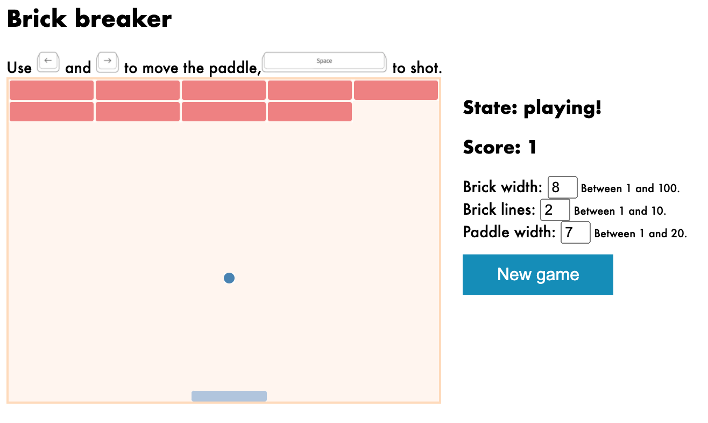

## Brick Breaker
Welcome to this ReactJS version of the classic Brick Breaker game.

## How to play
Use <kbd>left</kbd> and <kbd>right</kbd> to move the paddle and <kbd>space</kbd> to shot.

## Live DEMO
Please enjoy this [__LIVE DEMO__](https://aqueous-thicket-00518.herokuapp.com/)

 
### Purpose
The objective of this project was strength my skills with ReactJS through a practical experience. I modeled 
the state of the game with the following state:

```javascript
    this.state = {
      width: width,
      height: height,
      brickWidth: brickWidth,
      brickLines: brickLines,
      paddleWidth: paddleWidth,
      squares: Array(numberSquares).fill(null),
      ballPosition: null,
      ballDirection: 'north-east',
      paddlePosition: null,
      gameState: 'playing',
      score: 0,
      brickNumber: null,
    };
```

### Build with:
- React 16.13.1
- JavaScript
- This project was bootstrapped with [Zero-configuration Deploy to Heroku](https://blog.heroku.com/deploying-react-with-zero-configuration).


### Contribution
All contributions or feedback are welcome! There are many features that can be added, for example:
- Special bricks to discover new weapons.
- Add different levels.
- Improve the break of a brick from any direction.

### How to run this project in?

- You should have React installed [Download NodeJS](https://nodejs.org/en/)
- Navigate to the project directory
- Enter the following command `npm install` this will install all required dependencies
- Enter the following command `npm start`
- Open [http://localhost:3000](http://localhost:3000) to view it in the browser.


### License
[](https://opensource.org/licenses/MIT)